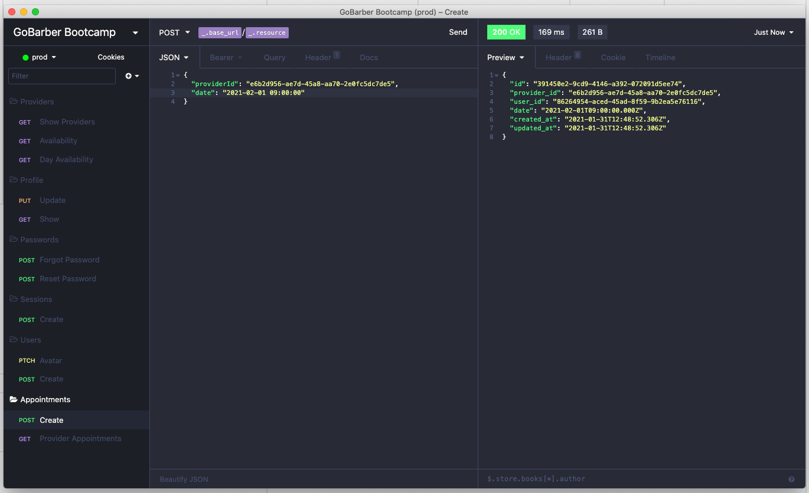

<!-- Info Header -->
<table>
  <tr>
    <td>
      
    </td>
    <td>
      <h3>
        Projeto criado no Gostack Bootcamp: API Gobarber
      </h3>
      
Pequena API criada em Node, usando Typescript com a abordagem SOLID, DDD e TDD.

      

        
        
      

      <p">
        <a href="#telas-do-sistema">Print da API sendo consumida pelo Insomnia:</a>&nbsp;&nbsp;&nbsp;|&nbsp;&nbsp;&nbsp;
        <a href="#descrição">Descrição</a>
      

    </td>
  </tr>
</table>

#### Telas do Sistema

    

---

#### Descrição

Pequena API criada em Node, usando Typescript com a abordagem SOLID, DDD e TDD, essa API gerencia agendamentos de uma Barbearia, pode-se criar Usuários, Recuperar Senha, criar e consultar agendamentos.

Para quem quiser utilizar o projeto execute os comandos para criar as migrations e popular:

yarn typeorm migration:run

yarn seed:run

Isso irá criar alguns dados de exemplos, com dois e-mails para testes:

client@gobarber.com.br

provider@gobarber.com.br

A senha para todos usuários são 123456

---

#### Visualizar o projeto na IDE:

Para quem quiser visualizar o projeto na IDE esse recurso do GitHub é bem bacana:

https://github1s.com/alcir-junior-caju/study-js-node-gostack-gobarber

---

#### Configuração Insomnia:

