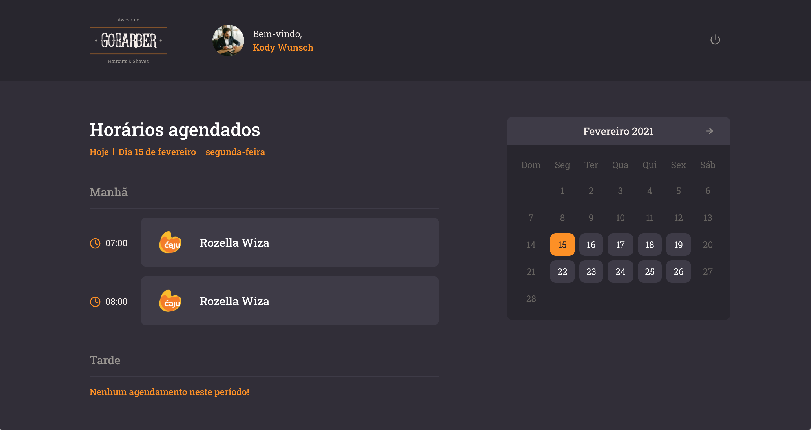
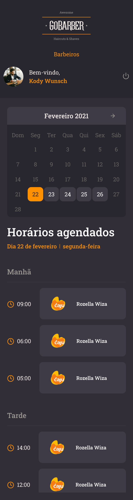

<!-- Info Header -->
<table>
  <tr>
    <td>
      
    </td>
    <td>
      <h3>
        Projeto criado no Gostack Bootcamp: Frontend Gobarber
      </h3>
      
Pequena aplicação criada usando Reactjs aplicando Context API.

      

        
        
      

      <p">
        <a href="#telas-do-sistema">Telas da aplicação:</a>&nbsp;&nbsp;&nbsp;|&nbsp;&nbsp;&nbsp;
        <a href="#descrição">Descrição</a>
      

    </td>
  </tr>
</table>

#### Telas do Sistema

    

    

    

    

    

<table>
  <tr>
    <td style="vertical-align:top">
      
    </td>
    <td style="vertical-align:top">
      
    </td>
  </tr>
</table>

<table>
  <tr>
    <td style="vertical-align:top">
      
    </td>
    <td style="vertical-align:top">
      
    </td>
  </tr>
</table>

---

#### Visualizar o projeto na IDE:

Para quem quiser visualizar o projeto na IDE esse recurso do GitHub é bem bacana:

https://github1s.com/alcir-junior-caju/study-js-reactjs-gostack-gobarber

---

#### Descrição

Pequena aplicação frontend criada usando a Context API, consumindo a API em node, onde temos sistema de autenticação, atualização de perfil, sistema de notificação via toasts e busca nos agendamentos.

Como optei por não desenvolver o app passei as funcionalidades do app para web.
